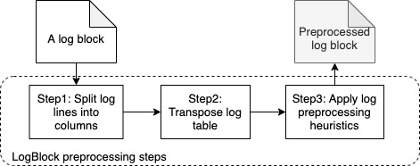
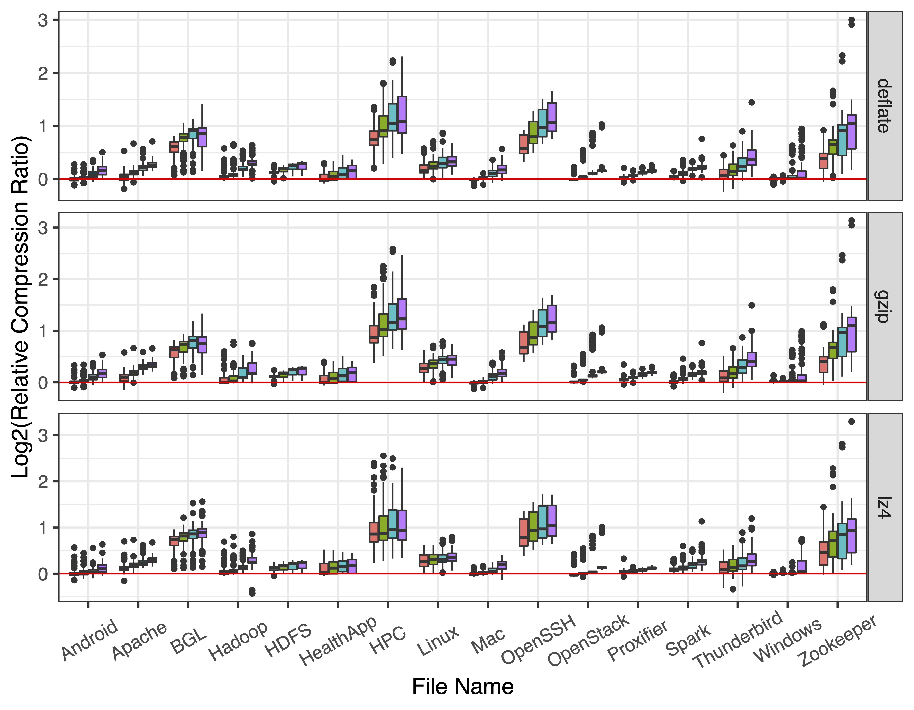
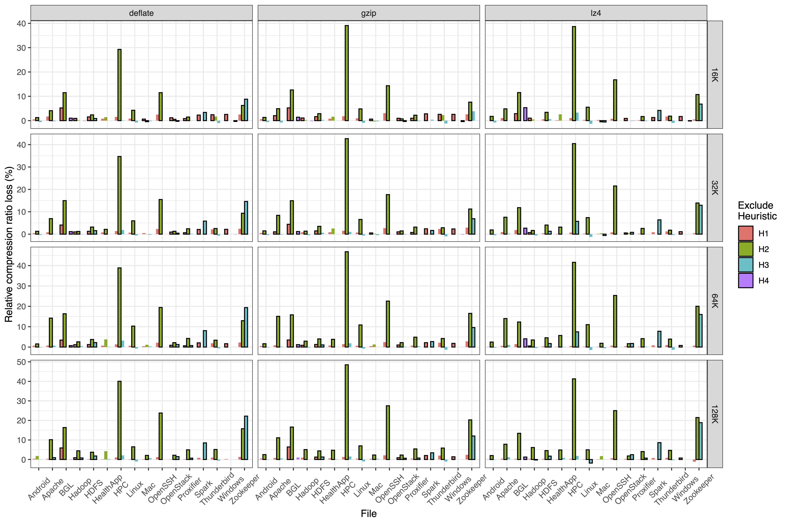
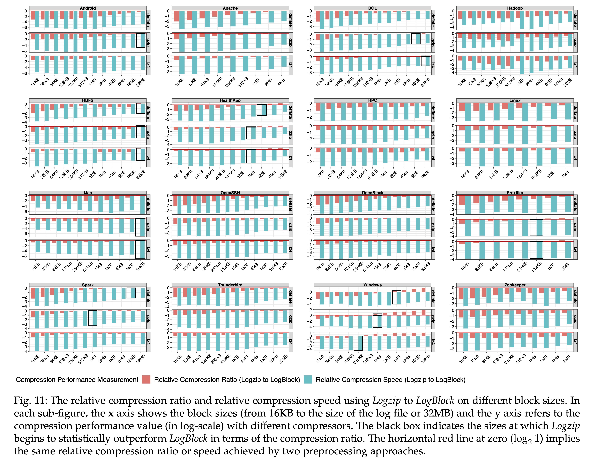
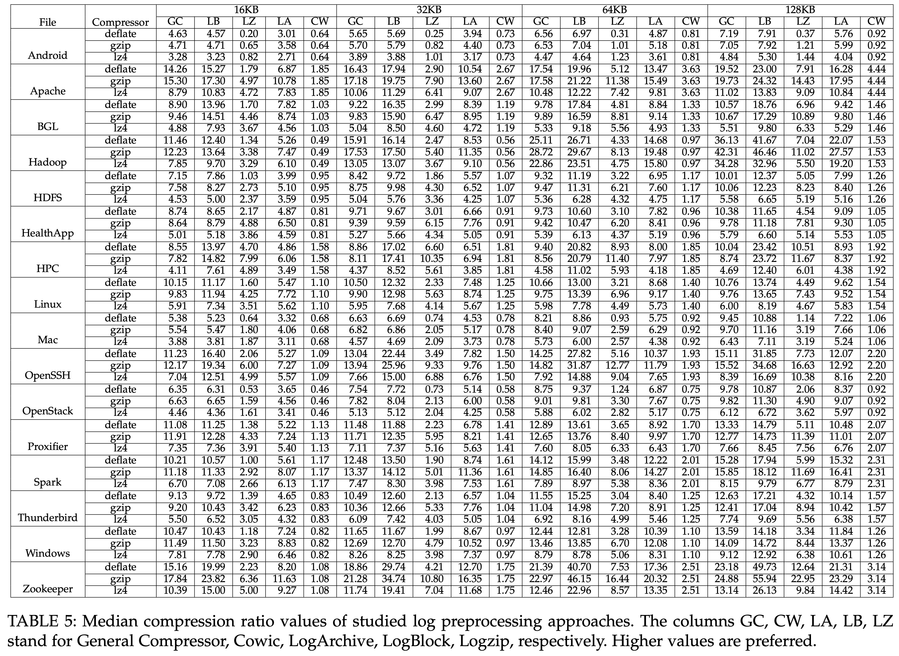
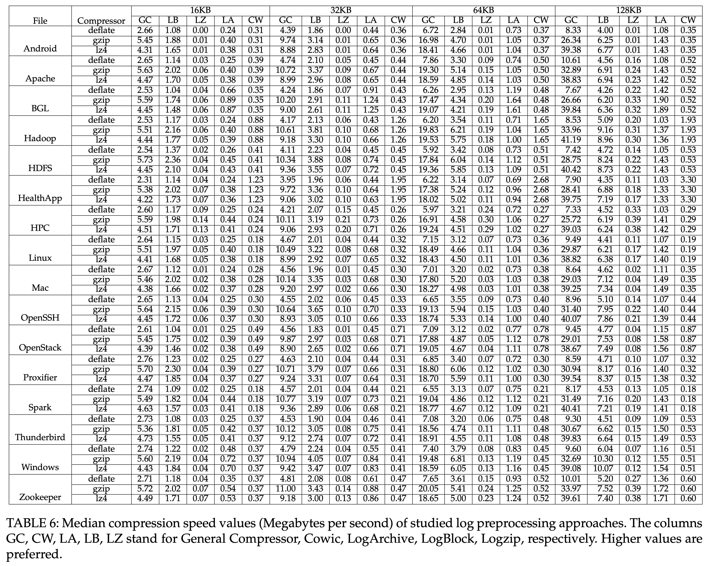

## Design

LogBlock first splits log data into different columns, so the log data is regarded as a matrix.
Then, the matrix is transposed to gather similar tokens which can be easily referable by the sliding window encoder (see the [shortcomings of sliding window](https://cs.stanford.edu/people/eroberts/courses/soco/projects/data-compression/lossless/lz77/shortcoming.htm)). 
Finally, each type of repetitiveness in log data will be further reduced by its corresponding heuristic. The overall workflow is shown in the following figure.

 
## Evaluation

### The compression ratio of LogBlock compared to general compressors.
The relative compression ratio (in log-scale) between compression without and after preprocessing using Logzip. Each box shows the distribution of relative compression ratio of 100 blocks from the same log file using a specific block size (16KB, 32KB, 64KB and 128KB) and compressor (gzip, lz4 and deflate). The horizontal red line at zero (log2 1) is the baseline that indicates the relative compression ratio without preprocessing.

### The impact of each preprocessing heuristic on the compression performance.
The impact on relative compression ratio from disabling each preprocessing heuristic. The y-axis measures the relative compression ratio loss in percentage. Bars with a border imply that a statistically significant difference occurs after excluding such a heuristic. H1 refers to Extract unique tokens. H2 refers to Delta encoding for numbers. H3 refers to Build dictionary for repetitive tokens. H4 refers to Extract common prefix strings.

The impact on relative compression speed from disabling each preprocessing heuristic. The y-axis measures the relative compression speed increment in percentage. Bars with a border imply that a statistically significant difference occurs after excluding such heuristic.

### The block sizes that Logzip begin to outperform LogBlock.
The relative compression ratio and relative compression speed using Logzip to LogBlock on different block sizes. In each sub-figure, the x axis shows the block sizes (from 16KB to the size of the log file or 32MB) and the y axis refers to the compression performance value (in log-scale) with different compressors. The black box indicates the sizes at which Logzip begins to statistically outperform LogBlock in terms of the compression ratio. The horizontal red line at zero (log2 1) implies the same relative compression ratio or speed achieved by two preprocessing approaches.

## The compression performance of different log compression approaches on small logs
The following results are included in the appendix section of the paper.

